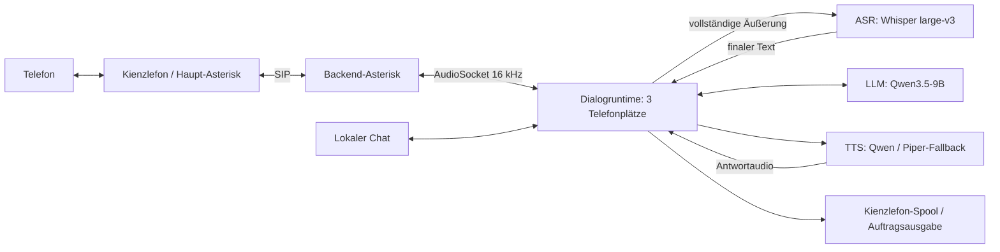

# Kienzlefon AI

Lokale KI-Dienste und Telefonie-/Dialogruntime für Kienzlefon. Das Projekt verbindet Spracherkennung, ein Sprachmodell und Sprachausgabe mit einer Asterisk-Anbindung für die strukturierte Aufnahme von Praxisanliegen. Ein lokaler Chat verwendet dieselbe Dialogruntime.

**Stand: 30. September 2026 · CUDA-/Backendlinie bis 2.5.2 · AMD-Linie 1.0.2.**

## Projektstatus: einsatzfähig mit zwei Kanälen · Work in progress

- **Einsatzfähig mit zwei gleichzeitigen Telefonkanälen.** Wenn auf demselben System zusätzlich Sprachdokumentation mit [Kienzledoku](https://kienzledoku.de) hinzukommen kann, sollte es bei höchstens zwei Telefonkanälen bleiben. Diese Betriebsempfehlung hält Reserve für die gemeinsame Nutzung vor; die technisch vorhandenen drei Telefonplätze sind keine Empfehlung für drei gleichzeitige Gespräche.
- **Work in progress.** Der praktische Einsatz und die weitere Erprobung laufen; offene Abnahmen und die Grenzen der bisherigen Messungen sind dokumentiert.
- **Nächstes Thema: eine bessere Stimme.** Die aktuelle Qwen-Stimme ist nach bisherigem Höreindruck nur mittelmäßig. Als Nächstes stehen Versuche für eine natürlichere und angenehmere Sprachausgabe an.
- **Framework Desktop für einen Lauftest gesucht.** Wer einen Framework Desktop mit **mindestens 64 GB Speicher** zur Verfügung stellen kann, bitte melden. Die Lauffähigkeit auf dieser Hardware ist noch zu prüfen.
- **Auch ein klassisches IVR ist eine Überlegung wert:** [Kienzlefon classic](https://kienzlefon.de) für festgelegte Menüabläufe mit definierten, berechenbaren Ergebnissen innerhalb der vorgesehenen Anliegen.

Die Zwei-Kanal-Empfehlung beschreibt den vorgesehenen Praxisbetrieb. Die bisherigen GPU-Lasttests ersetzen keine Dauerlastabnahme von Telefonie und Sprachdokumentation zusammen.

**Die RX 7900 XTX wurde am 29. September mit allen vier AMD-KI-Rollen installiert und praktisch geprüft.** Der AMD-Installer 1.0.1 bestand 71 Selbsttests auf Ubuntu/XTX sowie echte Einzel- und Paralleltests, darunter zweimal acht gleichzeitige Anfragen. Die Telefonruntime **2.5** wurde anschließend von der RTX-3090-Umgebung auf XTX übernommen und um Piper ergänzt; SIP-/Admission-Bereitschaft, Runtime-KI-Aufrufe und ein echter Reload wurden geprüft. Der Telefonbetrieb wurde am 30. September wieder auf der RTX 3090 aktiviert; die XTX-Befunde dokumentieren den vorausgegangenen Teststand.

Das separat versionsgeführte CUDA-/Backend-Paar 2.5.1 ist dadurch nicht als installiert oder auf XTX abgenommen anzusehen. Systematische Telefon-/Hörabnahme, Dauerlast, Reboot und ausreichende VRAM-Reserve bleiben eigene Prüfpunkte. Einzelheiten und Messbedingungen: [Benchmarks und aktueller Hardwarestand](docs/BENCHMARK-XTX-v1.0.md).

**AMD 1.0.2 ergänzt ausschließlich Lizenz- und Änderungshinweise.** 71 lokale Selbsttests und der Paketvergleich sind bestanden; eine erneute XTX-Installation erfolgte nicht. Die Hardwarebefunde oben beziehen sich weiterhin auf 1.0.1. [Änderungen und Prüfung](docs/RELEASE-NOTES-AMD-v1.0.2.md).

Repository: [thomaskien/kienzlefon-ai](https://github.com/thomaskien/kienzlefon-ai).

Kontakt: [tk@mampf.net](mailto:tk@mampf.net). Vertrauliche Sicherheitsmeldungen ebenfalls per E-Mail senden; Hinweise stehen in [SECURITY.md](SECURITY.md#debugging-und-berichte).

## Angenehme Überbrückung während der Antwortberechnung

Kurze, regelmäßige Pieptöne überbrücken die Wartezeit zwischen einer Äußerung und der Antwort. Sie werden im bisherigen Einsatz als angenehm empfunden und geben eine hörbare Rückmeldung, dass die Verarbeitung weiterläuft. Dauert sie länger, ergänzen kurze Ansagen die Töne. Die Pieptöne verkürzen die Berechnung selbst nicht.

Der neue Standard in **2.5.2** lässt zunächst mehr Raum für die Töne. Mit den ausgewählten Ansageclips ergibt sich ab dem erkannten Sprachende folgende Folge, solange noch kein Antwortaudio bereitliegt:

| Wartephase | Hörbare Rückmeldung |
|---|---|
| Beginn bis zur ersten Ansage | Fünf kurze Pieptöne im Sekundentakt; nach 5 Sekunden „Bitte warten.“ |
| Nach der ersten Ansage | Drei weitere Pieptöne; nach insgesamt 11 Sekunden „Ich verarbeite.“ |
| Bei weiterem Warten | Weitere Pieptöne in den Sprachpausen; nach insgesamt 17 Sekunden nochmals „Bitte warten.“ |

**Eine fertige Antwort hat Vorrang:** Die Folge muss nicht vollständig durchlaufen werden. Sobald Antwortaudio bereitliegt, entfallen weitere Warteblöcke; ein bereits laufender Ton oder Sprachblock wird noch beendet. Töne und Ansagen überlagern sich nicht. Die genaue Tonzahl hängt von Clipdauer, Zeitkonfiguration und tatsächlichem Ablauf ab; die fünf/drei Töne gelten für die ausgewählten Standardclips.

### Stand des neuen Defaults

Zusätzlich zum unten dokumentierten Ausgangsstand ist das neue Paar [Backendinstaller 2.5.2](installer/kienzlefon-installer-asterisk-backend-v2.5.2.sh) und [KI-Installer 2.5.2](installer/install-kienzlefon-ai_v2.5.2.sh) lokal geprüft. Neue Standardzeiten 5/11/17 Sekunden ergeben mit den ausgewählten Clips fünf Pieptöne vor „Bitte warten.“ und danach drei vor „Ich verarbeite.“. Vorhandene TOML-Einstellungen bleiben erhalten; keine Serveraktivierung erfolgt. Der KI-Installer ist nur versionsangepasst und für dieses Wartefeedbackupdate nicht auszuführen. [Release Notes und Updatehinweise 2.5.2](docs/RELEASE-NOTES-v2.5.2.md).

## Was das Projekt bereitstellt

- Residente KI-Dienste für LLM, ASR und Qwen-TTS über den NVIDIA/CUDA-Zweig oder den separaten AMD/ROCm-Zweig; optional Pyannote zur Sprechertrennung.
- Drei getrennte Telefonplätze mit SIP, AudioSocket, VAD und strukturiertem Dialogzustand.
- Qwen als primäre Sprachausgabe und einen bereits vorhandenen Piper-Dienst als Fallback.
- Einen lokalen Chat und die Übergabe vollständiger Aufträge an die bestehende Kienzlefon-Spool-Verarbeitung.
- Konfigurierbare Warteansagen und Pieptöne sowie eine optionale Performanceaufzeichnung ohne Gesprächsinhalte.

Die Dialogruntime nimmt beispielsweise Rezeptbestellungen, Überweisungsanfragen, Terminwünsche und Rückrufbitten auf. Sie bucht keine Termine, stellt keine Rezepte aus und soll keine Diagnosen oder Therapieempfehlungen geben. Die im Systemprompt hinterlegten Praxisabläufe müssen vor einem Einsatz zur jeweiligen Praxis passen.

## Benchmark-Ergebnisse vom 29. September

| Messung | RX 7900 XTX | Einordnung |
|---|---:|---|
| Whisper `large-v3`, WhisperDoku-Profil | **17,60× Echtzeit** | Median aus drei Läufen derselben 39:03-Minuten-Aufnahme; RTX 3090 clientseitig 28,93× |
| Whisper, Beam 1 mit Wortzeitstempeln | **22,53× Echtzeit** | Zwei Läufe; Qualität separat zu prüfen, kein automatisch aktiviertes Telefonprofil |
| Qwen3.5-9B Q6_K, seriell / drei Anfragen aggregiert | **81,22 / 175,84 Token/s** | Rund 84 % / 92 % des gemessenen 3090-Durchsatzes; gesondertes Benchmark-Kontextprofil |
| Pyannote, 39:03-Minuten-Aufnahme | **26,78 s** | Laufzeit nahezu auf 3090-Niveau; unterschiedliche Sprecherzahlen, keine Qualitätsparität belegt |
| Installierte native Qwen-TTS, warm | **3,772× Echtzeit**, erstes PCM **57,041 ms** | Median aus drei Läufen mit 5,12 s Ausgabe |

Der frühere XTX-PyTorch-TTS-Pfad erreichte nur etwa Echtzeit und lieferte erst die gesamte Wellenform. Native HIP-TTS erreicht nun frühes echtes Streaming; drei synthetische Sätze wurden außerdem ohne Wortfehler rücktranskribiert. Das ist ein erfreulicher, begrenzter Vollständigkeitsbefund und keine allgemeine Hörabnahme. Vollständige 3090-Durchsatzparität ist nicht erreicht.

Die Messreihen unterscheiden sich in Ausführungsprofil, Dienstresidenz und teilweise Präzision. Der installierte Acht-Anfragen-Test bestand, belegte aber den verfügbaren VRAM praktisch vollständig. [Methodik, Wiederholungen, Fehlversuche und Grenzen](docs/BENCHMARK-XTX-v1.0.md) sind deshalb Teil der Ergebnisdarstellung.

## Testvergleich mit IONOS / Sophia

Die nachgereichte **inhaltliche Auswertung** vergleicht Kienzlefon Backend **1.9.6 („Archive 4“, vier Durchläufe à 150 Szenarien, 21.08.2026)** mit **Sophia (ein Durchlauf mit 150 Szenarien, 14.09.2026)**. In diesen historischen Tests war Kienzlefon bei palliativen Notfällen und dringlichen Fachanrufern stärker; Sophia trennte neue AU und Rezept teilweise besser. Es handelt sich um wiederholte synthetische Szenarien, nicht um eine Abnahme der aktuellen Runtime.

| Fachlicher Befund | Kienzlefon „Archive 4“ | IONOS / Sophia |
|---|---|---|
| Klassische Notfälle erkannt / Notfallreaktion | **80/80 (100 %)** | **ca. 20/20 (ca. 100 %)** |
| Palliative Notfälle erkannt / eindeutige Reaktion | **37/40 (92,5 %)** | **ca. 5/10 (ca. 50 %)** |
| Dringliche Fachanrufer: Weiterleitung vorgesehen / beobachtet | **20/20 (100 %)** | **4/5 (80 %)** |
| Formulare: richtiger Auftragstyp | **16/20 (80 %)** | **4/5 (80 %)**; strukturierte Personenfelder fehlten |
| Neue AU und Rezept zusammen | Schleife in einem Durchlauf | Rezeptauftrag blieb erhalten; AU-Regel weiterhin abweichend |

Bei Sophia waren einfache Rezepte und Überweisungen eine Stärke; zugleich gab es verlorene Auftragsdetails, Personenverwechslungen und Schwächen bei akuten Pflegefällen. Nach Herausrechnung regelkonformer Weiterleitungen hatten **42/45 (93,3 %)** der technisch erfolgreichen, speicherpflichtigen Fälle einen Datensatz; der Auftragstyp stimmte in **30/45 (66,7 %)** exakt. Fehlendes JSON bei regelkonformer Weiterleitung zählt dabei nicht als Datenverlust.

Technisch bestanden **586/600 (97,7 %)** der Kienzlefon- und **83/150 (55,3 %)** der Sophia-Ausführungen. Diese Quoten sind wegen unterschiedlicher Testwege nicht unmittelbar vergleichbar: Kienzlefon wurde über die Textschnittstelle geprüft, Sophia über den Telefon-/Audiopfad. Die fachlichen Urteile stammen aus der nachgereichten Analyse; zentrale technische Zahlen wurden lokal abgeglichen. Das ursprüngliche `NOT_PERFORMED` bezeichnet nur die fehlende automatische Inhaltsbewertung der Testsuite. Eine vergleichende Hörbewertung der Stimmen liegt damit weiterhin nicht vor. [Kompakte Ergebnisse, Quellen und Einordnung](docs/VERGLEICH-SOPHIA-v1.1.md).

## Getrennte KI- und Telefonieinstallation

| Datei | Aufgabe |
|---|---|
| [install-kienzlefon-ai_v2.5.1.sh](installer/install-kienzlefon-ai_v2.5.1.sh) | KI-Server: `llm`, `asr`, `tts`, optional `pyannote`; prüft vorhandenen NVIDIA-Treiber und CUDA |
| [kienzlefon-installer-asterisk-backend-v2.5.1.sh](installer/kienzlefon-installer-asterisk-backend-v2.5.1.sh) | Dedizierter Asterisk-Backendstand, SIP, Telefonagenten, Dialog, Chat und Kapazitätsmeldung |
| [7900XTX/install-kienzlefon-ai-amd-v1.0.2.sh](7900XTX/install-kienzlefon-ai-amd-v1.0.2.sh) | Eigenständiger AMD-KI-Zweig für RX 7900 XTX / ROCm; installiert weder Telefonie noch Piper |

CUDA-Server- und Backendinstaller werden als versionsgleiches Paar geführt. Der AMD-Installer besitzt eine eigene Versionslinie. Ein reines Backendupdate auf 2.5.1 erfordert **keinen erneuten Lauf eines KI-Serverinstallers**. Dieser könnte Pakete, Modelle, Units und Konfigurationen erneut bearbeiten. Für AMD gilt die [eigene Installationsanleitung](docs/AMD-INSTALLATION-v1.0.2.md).

Der Backendinstaller ersetzt nach Sicherung `/etc/asterisk/pjsip.conf` und `/etc/asterisk/extensions.conf`. Er ist für eine dedizierte Kienzlefon-Backendinstanz vorgesehen. Vor seiner Verwendung [Voraussetzungen und Installationsablauf](docs/INSTALLATION-v2.5.1.md) lesen.

## Architektur im Überblick



Seit 2.4 verarbeitet die Telefonruntime vollständige Äußerungen nach dem Sprachende: ASR, dann genau eine endgültige LLM-Anfrage, dann Antwort-TTS. Die Standardpause zur Erkennung des Sprachendes beträgt 500 ms. Barge-in und spekulative LLM-Anfragen sind in 2.5.1 nicht enthalten. Der ASR-Dienst nutzt weiterhin WhisperLiveKit/SimulStreaming; die Telefonruntime überträgt ihre Äußerung erst nach dem VAD-Endpunkt.

Pyannote ist ein optionaler eigenständiger Dokumentationsdienst und gehört nicht zu diesem Telefonpfad. Weitere Details: [Architektur und Schnittstellen](docs/ARCHITEKTUR-v2.5.1.md).

Im **CUDA-Installer 2.5.1** hat Pyannote eine eigene Bind-Adresse: Ohne eigene Bestandskonfiguration verwendet der Dienst `0.0.0.0:8183`, also alle IPv4-Schnittstellen. Er besitzt keine HTTP-Authentifizierung. Bestehende Adressen bleiben erhalten; Netzfreigaben müssen auf vertrauenswürdige Rechner begrenzt sein. Der **AMD-Installer 1.0.2** bindet dagegen auch Pyannote standardmäßig nur an Loopback. Die Backendruntime 2.5.1 führt die Wartefeedback-Funktionen aus 2.5 unverändert fort.

## Voraussetzungen

Die **CUDA-2.x-Linie** richtet sich an Ubuntu x86_64 mit NVIDIA/CUDA. Treiber und ein kompatibles CUDA-Toolkit mit `nvcc` müssen vorhanden sein. Der **separate AMD-Zweig 1.0.2** setzt Ubuntu 24.04 x86_64, Python 3.12, die GA-Kernellinie 6.8, vorhandene ROCm 7.2.4 und genau eine RX 7900 XTX/gfx1100 voraus. Beide KI-Zweige vermeiden stillen CPU-Inferenzfallback. Neue macOS-, Framework-/gfx1151- oder beliebige AMD-GPU-Unterstützung ist damit nicht zugesagt.

Die NVIDIA-Referenz besitzt eine RTX 3090 mit 24 GB VRAM, 64 GB RAM und einen Ryzen 9 5900X unter Ubuntu 24.04.4 LTS. Die getestete XTX besitzt ebenfalls 24 GB VRAM. Das sind Referenzkonfigurationen, keine ermittelten Mindestanforderungen. Die acht parallelen AMD-Anfragen ersetzen keinen Dauerbetrieb dreier vollständiger Telefongespräche.

Für die Telefoniefunktionen werden außerdem die bestehende Kienzlefon-Installation samt Spool-/Ausgabe-API, ein Haupt-Asterisk mit Admission-/Handoff-Anbindung, drei SIP-Konten und ein vorhandener Piper-Dienst benötigt. Dieses Repository allein ersetzt diese Umgebung nicht. Downloads von Paketen und Modellen benötigen während der Einrichtung Netzwerkzugang.

Der CUDA-Pyannote-Dienst ist bewusst im geschützten Praxisnetz erreichbar, damit andere berechtigte Praxisrechner ihn nutzen können. Der Betreiber hat die Standardbindung an alle IPv4-Schnittstellen bestätigt. Zugriffsschutz erfolgt über die Netzumgebung; die API besitzt keine eigene Anmeldung. Einzelheiten: [Sicherheit und Netzbindung](SECURITY.md#betriebsgrenzen).

## Einstieg

Aus dem Projektwurzelverzeichnis lassen sich Version und Optionen der beiden unter `installer/` abgelegten 2.5.1-Dateien ohne Installation anzeigen:

```bash
bash installer/install-kienzlefon-ai_v2.5.1.sh --version
bash installer/install-kienzlefon-ai_v2.5.1.sh --help
bash installer/kienzlefon-installer-asterisk-backend-v2.5.1.sh --version
bash installer/kienzlefon-installer-asterisk-backend-v2.5.1.sh --help
```

Die Installations- und Updatebefehle stehen mit ihren Voraussetzungen in der [Installationsanleitung](docs/INSTALLATION-v2.5.1.md). Die Wartefeedback-Schlüssel setzen mindestens Backendruntime 2.5 voraus und werden in 2.5.1 unverändert unterstützt.

## Verzeichnisstruktur

- [installer/](installer/README.md): versionierte CUDA- und Backendinstaller.
- [tests/](tests/README.md): Testprogramme, Requirements und Szenariopakete.
- [docs/spezifikationen/](docs/spezifikationen/README.md): Server-, Integrations- und Testsuitenspezifikationen.
- `docs/anleitungen/` und `docs/historie/`: ältere Anleitungen und Übergaben.
- `archiv/` und `lokal/`: erhaltene Altbestände, Pakete, Hörproben und lokale Hilfsdateien; keine Veröffentlichungsauswahl.

Die [vollständige Verzeichnisübersicht](docs/STRUKTUR.md) erläutert die Ablage und die erhaltenen Arbeitsordner. Bestehende Programmversionen wurden unverändert verschoben. Befehle in dieser README beziehen sich auf die Projektwurzel.

## Dokumentation

| Dokument | Inhalt |
|---|---|
| [Benchmarks und Hardwarestand](docs/BENCHMARK-XTX-v1.0.md) | Aktuelle XTX-/3090-Ergebnisse, native TTS, installierte Dienste, Telefonieübernahme und Grenzen |
| [Vergleich mit IONOS / Sophia](docs/VERGLEICH-SOPHIA-v1.1.md) | Inhaltliche Ergebnisse aus „Archive 4“ und Sophia, faire Speicherquote, technische Ergebnisse und Prüfgrenzen |
| [AMD-Installation 1.0.2](docs/AMD-INSTALLATION-v1.0.2.md) | Eigenständiger RX-7900-XTX-Zweig, Voraussetzungen, Rollen und Loopback-Standard |
| [CUDA-Installation und Backendupdate](docs/INSTALLATION-v2.5.1.md) | NVIDIA-Voraussetzungen, Rollen, GPU-Auswahl und Backendupdate; Stand 28. September |
| [Betrieb und Konfiguration](docs/BETRIEB-v2.5.1.md) | Wartefeedback, Reload, Chat, technische Diagnose und Fehlerbehebung |
| [CUDA-/Backendarchitektur](docs/ARCHITEKTUR-v2.5.1.md) | Modelle, Ports, Verantwortlichkeiten und Datenfluss; AMD-Unterschiede siehe eigene Anleitung |
| [CUDA-/Backend-Testanleitung](docs/TESTS-v2.5.1.md) | Lokale Prüfungen und damaliger Validierungsstand vom 28. September; aktuelle Hardwarebefunde im neuen Bericht |
| [Release Notes 2.5.1](docs/RELEASE-NOTES-v2.5.1.md) | CUDA-/Backend-Änderungen gegenüber 2.4.2 und 2.5; keine AMD-Release Notes |
| [Lizenzprüfung und Fremdkomponenten](docs/LIZENZPRUEFUNG-2026-09-30-v1.1.md) | Geprüfte Lizenzen und abgeschlossene Hinweiskorrektur in AMD 1.0.2 |
| [Sicherheit und Datenschutz](SECURITY.md) | Geheimnisse, Netzgrenzen, Debugausgabe und Umgang mit Fehlerberichten |
| [Aktualisierte Veröffentlichungscheckliste](docs/VEROEFFENTLICHUNG-2026-09-30-v1.9.md) | Dateiauswahl mit verbindlichem Ausschluss von Token und Hörproben sowie offenen Schritten für GitHub |

Die versionierten Dokumente bleiben als jeweiliger Stand erhalten. Die Benchmarkübersicht beschreibt die XTX-Prüfungen und Migration vom 29. September einschließlich nachträglich ergänztem Piper und Telefonruntime. Der oben genannte Projektstatus berücksichtigt die spätere Rückkehr des Telefonbetriebs zur RTX 3090.

Die versionierten Installer enthalten ihre Runtime-Payloads. Alte Einzeldateien für Prompt, Overlay, Chat oder TTS sind historische Entwicklungsstände und dürfen nicht ohne Versionsprüfung als aktuelle Installation kombiniert werden.

## Testsuiten

- [Dialog-Testsuite 1.2.6](tests/kienzlefon-dialog-testsuite-v1.2.6.py) mit [150 synthetischen Szenarien](tests/kienzlefon-testsuite-spec-v1/).
- [Pipeline-Test 1.2.1](tests/kienzlefon-ai-pipeline-test-v1.2.1.py) für PCM → ASR → LLM → TTS → PCM.
- [Paralleltest 1.0.1](tests/kienzlefon-ai-parallel-test-v1.0.1.py) für gesonderte Lastmessungen.

Tests mit simulierten Diensten und ein technischer Exitcode 0 ersetzen weder Gesprächsabnahme noch Prüfung auf der tatsächlichen Telefon-/GPU-Hardware.

## Lizenz und Drittkomponenten

Kienzlefon AI steht unter der **[MIT-Lizenz](LICENSE)**. Copyright © 2026 Thomas Kienzle. Der vollständige Lizenztext liegt im Projektwurzelverzeichnis; er entspricht der [MIT-Lizenz der Open Source Initiative](https://opensource.org/license/mit).

Modellgewichte und Drittsoftware behalten ihre eigenen Lizenz- und Zugriffsbedingungen. [Lizenzprüfung](docs/LIZENZPRUEFUNG-2026-09-30-v1.1.md) und [vollständige Fremdlizenztexte](docs/lizenzen/README.md) dokumentieren den untersuchten Stand. Große LLM-, ASR-, TTS- und Diarisierungsgewichte werden separat geladen; das im AMD-Installer enthaltene WhisperLiveKit-Wheel bringt bereits kleine Silero-VAD-Modelle mit. AMD 1.0.2 enthält die ergänzten Lizenztexte und Änderungshinweise auch bei Einzelweitergabe der Installerdatei; die festgestellten Hinweislücken sind damit geschlossen.

**Hugging-Face-Token und Hörproben sind von der Veröffentlichung ausgeschlossen**, einschließlich ausgewählter Warteansagen, synthetischer Sprachproben sowie Kopien in Archiven und eingebetteten Paketen. Dokumentiert werden Eigenschaften und Testergebnisse, nicht die Audiodateien. Einzelheiten stehen in [SECURITY.md](SECURITY.md).
